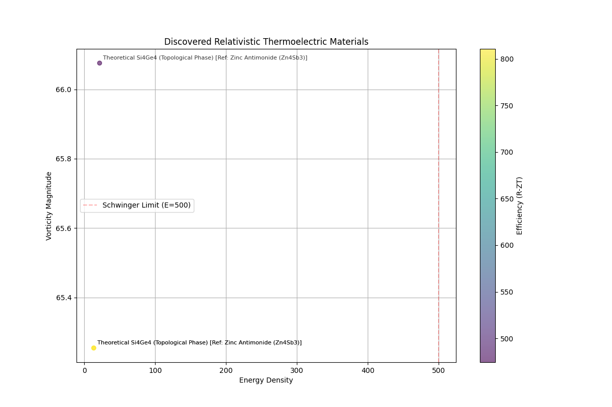
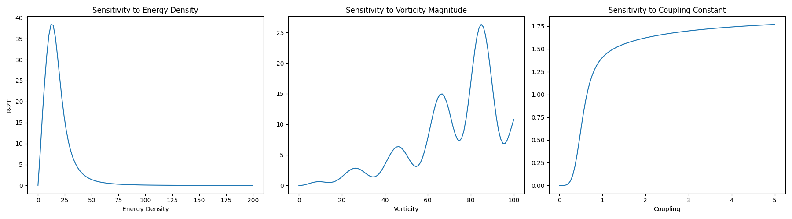

# Relativistic Thermoelectric Material Search

This suite implements a search framework for thermoelectric materials based on **Relativistic Electrodynamics** and **Quantum Electrodynamics (QED)**.

## Theoretical Framework

Unlike classical models, this framework treats materials as localized electromagnetic field configurations (solitonic vortices). The efficiency of a material is derived from the coupling between its electromagnetic stress-energy tensor ($T^{\mu\nu}$) and the four-current ($J^\mu$).

The key metric is the **Relativistic Figure of Merit (R-ZT)**:
$$ R\text{-}ZT = \frac{\kappa \cdot \text{Flux}}{1 + |\text{Trace}(T)| + \text{Dissipation}} $$

Where:
- **Flux**: Energy-momentum flow density from $T^{0i}$.
- **Trace(T)**: Relativistic mass-energy signature.
- **Dissipation**: QED-scale losses (modeled after pair production and vacuum polarization).

## Discovery Map



The map shows the relationship between energy density, vorticity magnitude, and efficiency for discovered configurations.

## Sensitivity Analysis



This analysis shows how the Relativistic Figure of Merit (R-ZT) responds to changes in individual field parameters.

## Project Structure

- `rel_tensor_util.py`: Covariant tensor operations (Minkowski metric $+---$).
- `material_engine.py`: Core physics engine and efficiency calculator.
- `parallel_search.py`: HPC-optimized random search using multiprocessing.
- `optimization_ga.py`: Genetic Algorithm for evolving optimal field configurations.
- `optimization_mo_ga.py`: Multi-objective GA (Efficiency + Stability).
- `material_db.py`: Persistence layer for discovered materials.
- `validate_real_materials.py`: Correlation tool against empirical data (Bi2Te3, PbTe, etc.).
- `chemical_translator.py`: Maps relativistic parameters to chemical nomenclature and bond types.
- `visualize_discovery.py`: Visualization generator.

## Chemical Mapping

The discovery suite now maps relativistic "solitonic parameters" to potential chemical substances:
- **Energy Density** $\rightarrow$ Atomic Mass / Material Density.
- **Vorticity Magnitude** $\rightarrow$ Structural Complexity / Topological Index.
- **Coupling** $\rightarrow$ Bond Type (Metallic, Covalent, or Ionic-Topological).

Discovered materials include a `substance` field and a `confidence` score based on proximity to known thermoelectric anchors.

## How to Run

### 1. Perform a Parallel Search
```bash
python3 parallel_search.py --total_iterations 1000
```

### 2. Run the Genetic Optimizer
```bash
python3 optimization_ga.py
```

### 3. Generate Visualizations
```bash
python3 visualize_discovery.py
```

### 4. Run Validation
```bash
python3 validate_real_materials.py
```

### 5. Analyze a Specific Formula
```bash
python3 analyze_formula.py PbTe
```

### 6. Generate a Discovery Report
```bash
python3 generate_report.py
```

### 7. Compare Two Materials
```bash
python3 compare_materials.py Bi2Te3 PbTe
```

## Requirements
- NumPy
- Matplotlib
